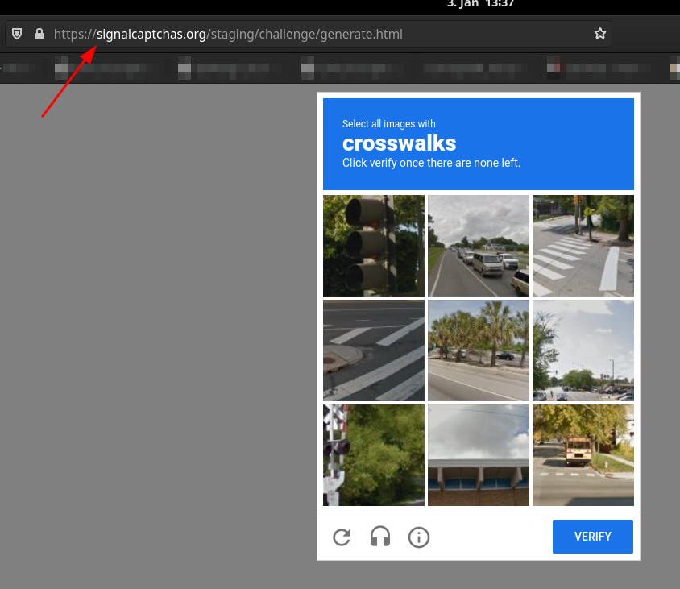
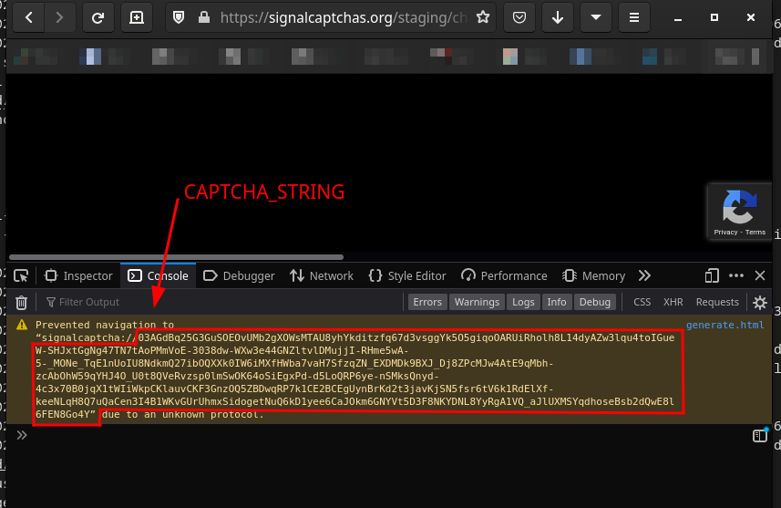
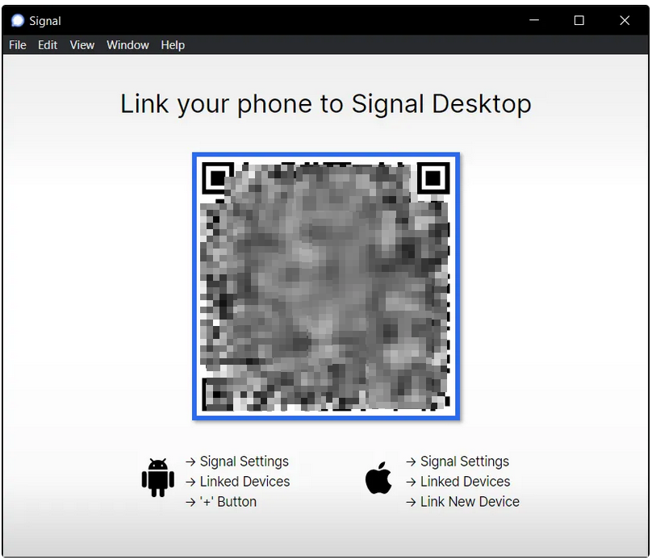
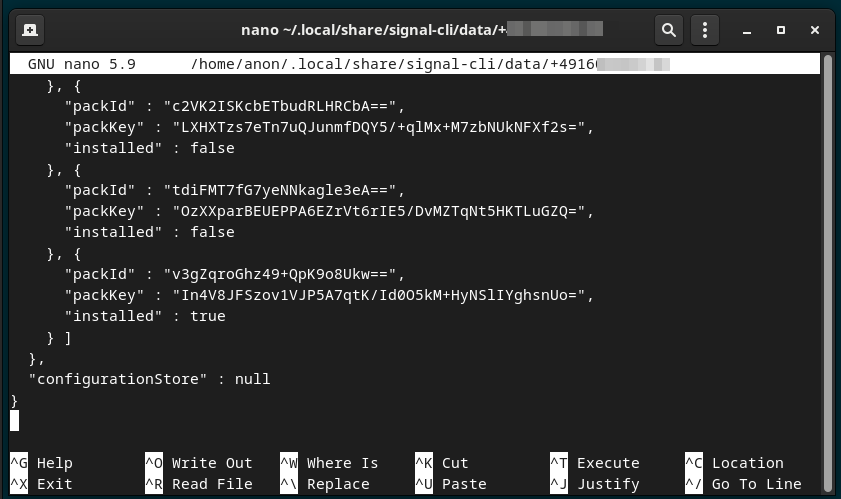
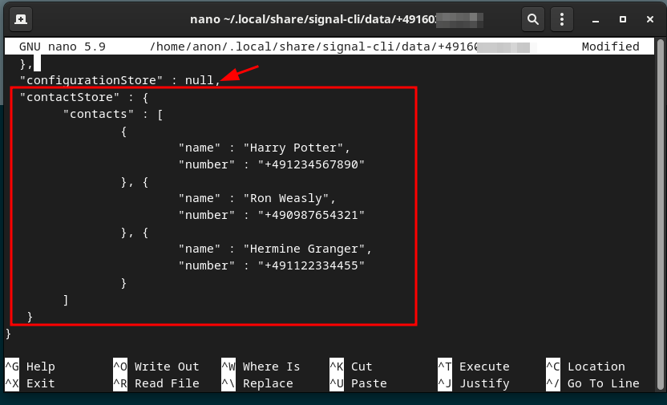
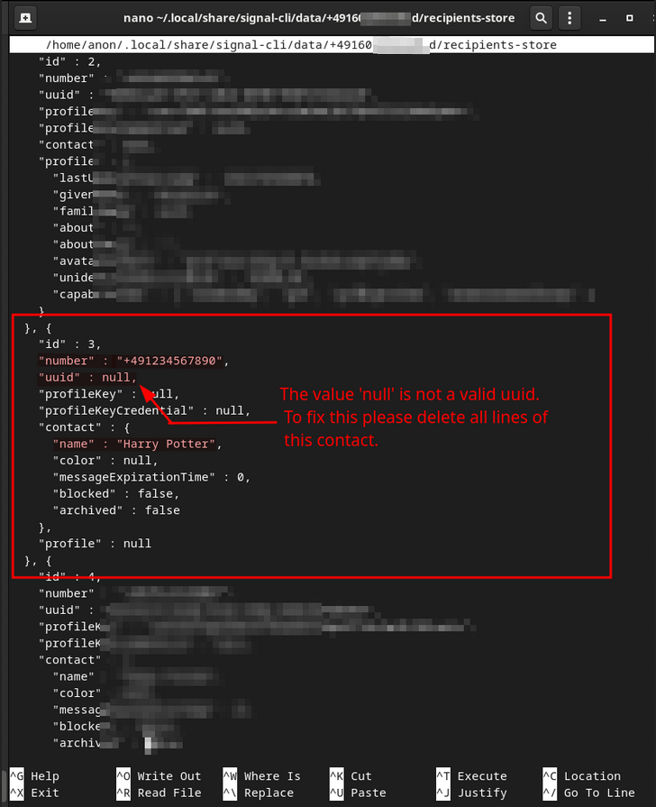

# How to use Signal without a Smartphone

The Signal messenger is an end-to-end encrypted messenger which can be used on mobile apps for android and ios and also in desktop apps for Linux, Mac and Windows. 
Unfortunately Signal is very focused on Smartphones and some features like registration, adding contacts and changing profile properties are limited to the mobile apps and don't work with the desktop applications. 
If you want to use Signal even though you have no smartphone you have to find a way to still do these things that are not possible in the desktop apps. 
One way would be to install a virtual android somewhere and do things like registration in your virtual android app. 
Unfortunately this also has a lot of pitfalls. For example it is not so easy to let your virtual android app use your computers camera to verify QR codes. 
Also you have to keep in mind that Signal expects the user to use every activated device from time to time. If this is not done the rarely used device is removed for security reasons. This would also mean that you have to use your virtual android app regularly. 

To get around all this pain the project https://github.com/AsamK/signal-cli provides us with a nice command line tool. 
This dbus based cli can interact with the Signal servers to perform features like registration (and others) even without an android device.

## Installation of Signal Commandline Interface 

To install the Signal-cli we can either download it directly from the releases published on Github or use the AUR package 
 - https://aur.archlinux.org/packages/signal-cli/

to install it directly on arch linux based systems. 

If you want to download it from Github directly please go to 
 - https://github.com/AsamK/signal-cli/releases/latest

check for the latest release and replace this in the below commands.

### Installation
``` 
# download everything
wget https://github.com/AsamK/signal-cli/releases/download/v0.10.0/signal-cli-0.10.0.tar.gz

# unpack it to /usr/local/bin
sudo tar -xvzf signal-cli-0.10.0.tar.gz --directory=/usr/local/bin/

# linkf from /usr/local/bin to /usr/bin
sudo ln -s /usr/local/bin/signal-cli-0.10.0/bin/signal-cli /usr/bin/signal-cli
```

### Check Installation
After a successful installation the package should be available from every directory in your system. 
You can test this by running
```
signal-cli -v
```
which should print your version number
```
signal-cli 0.10.0
```

## Register for a new account 
At very first you need to create a new account. For this you will need a phone number. 
As this phone number will be used as your 'user id' which makes it possible for your contacts to find you, please think twice about using public proxy numbers.

To request a registration fory our mobile number you can use the below command.
Please don't forget to replace `YOUR_NUMBER` with your phone number in the format of `+491234567890`

```
signal-cli -u YOUR_NUMBER register
```
This will send a verification code via SMS

```
signal-cli -u YOUR_NUMBER verify VERIFICATIONCODE
```

It might be that the register step requires you to solve a captcha. 
In this case you will be prompted to open a link in the browser, solve the captcha, copy the result of the captcha from the failed redirect message in the browsers development console. 

(At the time this how-to was created this link was `https://signalcaptchas.org/staging/challenge/generate.html` )

Once the captcha is solved you can copy the result string and repeat the register command with the --captcha option






```
signal-cli -u YOUR_NUMBER register --captcha CAPTCHA_STRING
signal-cli -u YOUR_NUMBER verify VERIFICATIONCODE
```

## Install Signal desktop client
Follow the instructions at https://signal.org/download/ to install the signal desktop client at your system 

## Add Signal Desktop Client as a new device
If you open the Signal Desktop Client, it will ask you to connect the client to your 'master' installation, in this case to the signal cli. 


Usually in this step you need to scan the QR-code with your mobile-phones camera. 
In the case of signal cli we have to take a screenshot of the QR code and read the QR code with:
```
zbarimg /tmp/qr.png
```
This will print something like : 
```
QR-Code:sgnl://linkdevice?uuid=XXXXXXXXXXXXXXXXXXXXXXXXXXXXXXXXXXXXXXXXXXXXXXXXXXXXXXXXXXXXXXXXXXXXXXXXXXX

scanned 1 barcode symbols from 1 images in 0,02 seconds

	. EAN/UPC (EAN-13, EAN-8, EAN-2, EAN-5, UPC-A, UPC-E, ISBN-10, ISBN-13)
	. DataBar, DataBar Expanded
	. Code 128
	. Code 93
	. Code 39
	. Codabar
	. Interleaved 2 of 5
	. QR code
	. SQ code
  - is the barcode large enough in the image?
  - is the barcode mostly in focus?
  - is there sufficient contrast/illumination?
  - If the symbol is split in several barcodes, are they combined in one image?
  - Did you enable the barcode type?
    some EAN/UPC codes are disabled by default. To enable all, use:
    $ zbarimg -S*.enable <files>
    Please also notice that some variants take precedence over others.
    Due to that, if you want, for example, ISBN-10, you should do:
    $ zbarimg -Sisbn10.enable <files>
```

Copy the uuid string and paste it in the below command
```
signal-cli -u YOUR_NUMBER addDevice --uri "tsdevice:/?uuid=XXXXXXXXXXXXXXXXXXXXXXXXXXXXXXXXXXXXXXXXXXXXXXXXXXXXXXXXXXXXXXXXXXXXXXXXXXX"
```

## Change user profile information

```
# add profile picture
signal-cli -u YOUR_NUMBER updateProfile --avatar /tmp/avatar.png

# remove profile picture
signal-cli -u YOUR_NUMBER updateProfile --remove-avatar

# profile first name
signal-cli -u YOUR_NUMBER updateProfile --name anon

# profile second name
signal-cli -u YOUR_NUMBER updateProfile --family-name "anon-family"

# profile about text
signal-cli -u YOUR_NUMBER updateProfile --about "hello-world"
```

## Add contacts 
The signal desktop app does not provide the possibility to add contacts. 
If you want to add a contact either 

**A.** : Ask your new contact (which has a smartphone app) to add you as a new contact. Afterwards you can accept this in your desktop app. 

**B.** : use the sendCommands cli command. For this follow the below steps:


1. Open your local config at `~/.local/share/signal-cli/data/YOUR_NUMBER`
2. Add your new contacts in the following format to the config file
	```
	"contactStore" : {
		"contacts" : [ 
			{
				"name" : "Harry Potter",
				"number" : "+491234567890"
			}, {
				"name" : "Ron Weasly",
				"number" : "+490987654321"
			}, {
				"name" : "Hermine Granger",
				"number" : "+491122334455"
			}
		]
	}
	```

	Before adding the contacts it might look somehow like this:
	

	After adding the contacts it should look somehow like this:
	

3. Syncronize contacts of your local configs with all other devices with 
   ```
   signal-cli -u YOUR_NUMBER sendContacts
   ```
   
   Running this command will 
    - read the new contacts from the config at `~/.local/share/signal-cli/data/YOUR_NUMBER`, 
    - validate them (checks if they are existing at Signal), 
    - write them to your local contact store at `~/.local/share/signal-cli/data/YOUR_NUMBER.d/recipients-store`,
    - remove the new contacts from the config at `~/.local/share/signal-cli/data/YOUR_NUMBER`
4. Check your new contacts with:
    - Checking your desktop app 
    - Checking your local recipient store at `~/.local/share/signal-cli/data/YOUR_NUMBER.d/recipients-store`
    - Using the `listContacts` command 
      ```
      signal-cli -u YOUR_NUMBER listContacts
      ```

### Troubleshooting
Let's assume you have a typo in a telephone-number while adding a new contact OR you try to add a contact which is not yet registered to Signal. 
In this case the `sendContacts` command will fail with the following error : 
```
signal-cli -u YOUR_NUMBER sendContacts
WARN ManagerImpl - Failed to get uuid for e164 number: +491234567890
java.io.IOException: +491234567890
	at org.asamk.signal.manager.ManagerImpl.getRegisteredUser(ManagerImpl.java:915)
	at org.asamk.signal.manager.ManagerImpl.resolveSignalServiceAddress(ManagerImpl.java:1444)
	at org.asamk.signal.manager.helper.SyncHelper.sendContacts(SyncHelper.java:132)
	at org.asamk.signal.manager.ManagerImpl.sendContacts(ManagerImpl.java:1277)
	at org.asamk.signal.commands.SendContactsCommand.handleCommand(SendContactsCommand.java:30)
	at org.asamk.signal.App.handleLocalCommand(App.java:252)
	at org.asamk.signal.App.init(App.java:202)
	at org.asamk.signal.Main.main(Main.java:53)
```

This is because signal is not able to find any user with the number `+491234567890`.

Unfortunately until now the signal-cli is not able to recover from this problem on its own. 
This is due to the fact that the cli still added a new entry to the recipient store. But as it is not able to get any uuid for this not known number it added a new entry with uuid `null` to the recipient store. And once there is such an entry inside the recipient store, the cli refuses to add more contacts. 

To fix this you can simply manually edit the recipient store at `~/.local/share/signal-cli/data/YOUR_NUMBER.d/recipients-store` and remove the mal-formed entry :



## Register signal-cli as a systemd service
The Signal protocol expects that incoming messages are regularly received. If this is not the case the key material of the signal-cli might get out of sync and signal will deactivate this client after some time. To prevent this it makes sense to either regularly receive messages with the signal-cli account manually OR to run the signal-cli in the background as a systemd service. To do this follow the below steps:

1. Install `libunixsocket-java` for debian based systems or `libmatthew-unix-java` for arch linux based systems
2. Add the following service file to `/etc/systemd/system/signal-cli.service`
   ```
   [Unit]
   Description=Signal cli
   Requires=dbus.socket
   After=dbus.socket
   Wants=network-online.target
   After=network-online.target

   [Service]
   Type=simple
   Environment="SIGNAL_CLI_OPTS=-Xms2m"
   Environment="DBUS_SESSION_BUS_ADDRESS=unix:path=/run/user/1000/bus"
   User=anon
   ExecStart=/usr/bin/signal-cli -u YOUR_NUMBER --config /home/anon/.local/share/signal-cli daemon --ignore-attachments
   BusName=org.asamk.Signal

   [Install]
   WantedBy=multi-user.target
   ```
3. Replace `YOUR_NUMBER` with your mobile phone number 
4. Replace `user=anon` with the user you want to run the service with
5. Replace the config path with a path that points to your `.local/share` directory of your user
6. Check with `systemctl --user status dbus.socket` if you have a different dbus address than `unix:path=/run/user/1000/bus` and replace this if necessary
7. Ensure you have the current version of your service file loaded with:
   ```
   sudo systemctl daemon-reload
   ```   
9. Start the service with 
   ```
   sudo systemctl start signal-cli
   ```
8. Check if the service is running with 
   ```
   sudo systemctl status signal-cli
   ```
   and 
   ```
   journalctl -xeu signal-cli.service
   ```
